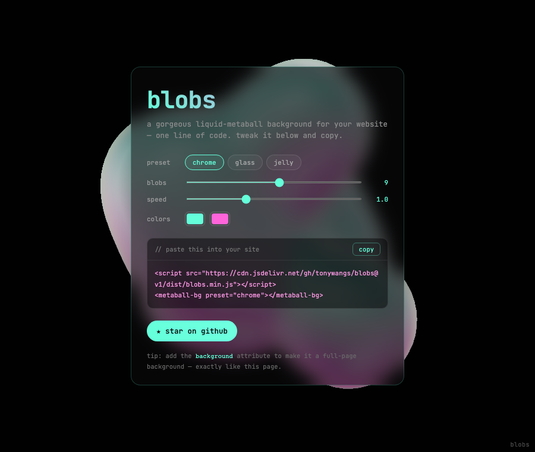

# 🫧 blobs

> A gorgeous animated liquid-metaball background for your website — in **one line of code**.

[Live demo & customizer](https://blobs-playground.vercel.app) · zero dependencies · MIT



## Quick start

Drop these two lines anywhere in your HTML:

```html
<script src="https://cdn.jsdelivr.net/gh/tonywangs/blobs@v4/dist/blobs.min.js"></script>
<metaball-bg></metaball-bg>
```

Want it as a full-page background behind your whole site? Add `background`:

```html
<metaball-bg background></metaball-bg>
```

## Customize

| attribute | values | default | what it does |
|---|---|---|---|
| `preset` | `chrome` · `glass` · `jelly` | `chrome` | material look |
| `blobs` | `1`–`16` | `9` | number of metaballs |
| `speed` | `0`–`3` | `1` | animation speed |
| `color1` | hex | `#64ffda` | top reflection color |
| `color2` | hex | `#ff64da` | bottom reflection color |
| `bg` | hex or `transparent` | `#0a0a0a` | background behind the blob |
| `quality` | `32` · `48` · `64` | `64` | mesh resolution (perf ↔ smoothness) |
| `background` | _(boolean)_ | — | fixed, full-page background mode |

Example:

```html
<metaball-bg preset="jelly" blobs="12" color1="#ff8a3d" color2="#3d6bff"></metaball-bg>
```

## Two ways to dial it in

Don't want to hand-write attributes? There are two visual tools:

- **[Playground](https://blobs-playground.vercel.app)** (`/`) — pick a preset, nudge a few sliders, copy your one-liner. For grabbing an embed fast.
- **[Studio](https://blobs.vercel.app)** (`studio/`) — the full control panel: every material, lighting, and bloom parameter, plus orbit + zoom. For serious design work — sculpt a bespoke look, then carry the settings into your embed.

## Why it won't slow your site down

- **Self-contained** — Three.js is bundled in (~124 KB gzipped). No dependencies, no build step on your end.
- **Lazy** — starts rendering only when it scrolls into view, and pauses when off-screen or on a hidden tab.
- **Polite** — respects `prefers-reduced-motion`, caps the device pixel ratio, and never intercepts clicks in background mode.

## Local development

```bash
npm install
npm run dev         # live customizer playground
npm run build       # → dist/blobs.min.js   (the embeddable widget)
npm run build:site  # → site-dist/          (the playground, as a static site)
```

The **studio** (full control-panel design tool) is its own app:

```bash
cd studio && npm install && npm run dev
```

## License

MIT © Tony Wang
